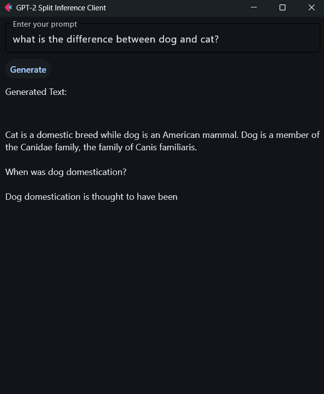
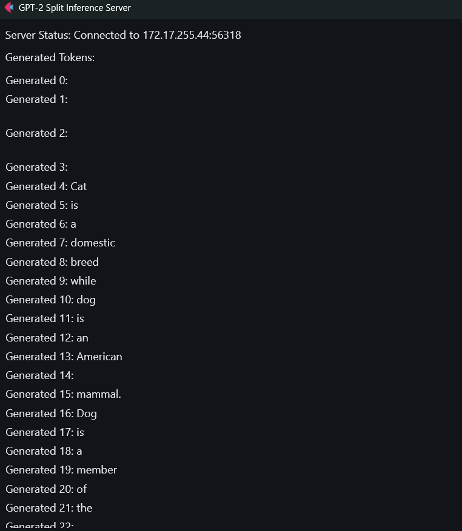

# Split Inference

In this project, the GPT-2 large model is divided into two parts: Upto embedding layers, it runs on phone and after that it runs on server/Laptop.

## GPT-2

```
GPT2LMHeadModel(
  (transformer): GPT2Model(
    (wte): Embedding(50257, 768)
    (wpe): Embedding(1024, 768)
    (drop): Dropout(p=0.1, inplace=False)
    (h): ModuleList(
      (0-11): 12 x GPT2Block(
        (ln_1): LayerNorm((768,), eps=1e-05, elementwise_affine=True)
        (attn): GPT2Attention(
          (c_attn): Conv1D(nf=2304, nx=768)
          (c_proj): Conv1D(nf=768, nx=768)
          (attn_dropout): Dropout(p=0.1, inplace=False)
          (resid_dropout): Dropout(p=0.1, inplace=False)
        )
        (ln_2): LayerNorm((768,), eps=1e-05, elementwise_affine=True)
        (mlp): GPT2MLP(
          (c_fc): Conv1D(nf=3072, nx=768)
          (c_proj): Conv1D(nf=768, nx=3072)
          (act): NewGELUActivation()
          (dropout): Dropout(p=0.1, inplace=False)
        )
      )
    )
    (ln_f): LayerNorm((768,), eps=1e-05, elementwise_affine=True)
  )
  (lm_head): Linear(in_features=768, out_features=50257, bias=False)
) with type <class 'transformers.models.gpt2.modeling_gpt2.GPT2LMHeadModel'>.
```

## GPT-2 Large

Vocab Size: 50257, Embedding Dim: 1280, Max Position Embeddings: 1024
Token embeddings saved with shape: (50257, 1280)
Position embeddings saved with shape: (1024, 1280)

# Client App

## Head model Architecture

Initially I tried using torch for head model but then I realized `torch` library is not available for android. So, to implement the head model (embedding layers), I used numpy.

1. Looking up token embeddings
2. Looking up positional embeddings
3. Adding these two embedding vectors.

- `save_embedding_weights.py`: This utility file saves the token and positional embedding layer weights as `.npy` files.
- `head_model_arch.py`: This class loads weight as `numpy` arrays and performs lookups using `numpy` indexing.

## Custom BPE Tokenizer

Using transformers library on client side was giving problem while running APK on phone. It was giving tqdm metadata file not found. That's why implementing a custom Byte Pair Encoding (BPE) tokenizer became a necessity.

- `save_tokenizer_files.py`: Download the required `vocab.json`, `merges.txt`, `special_tokens_map.json`, and `tokenizer_config.json` files.
- `custom_bpe_tokenizer.py`: This contains a Python implementation of the BPE algorithm that uses the GPT-2 tokenizer's specific vocabulary and merges rule. This is entirely generated by Gemini.

You can read more about this BPE tokenizer here [Sebastian Raschka](https://sebastianraschka.com/blog/2025/bpe-from-scratch.html).

# How to Run

Before running the program, you should first create a python virtual environment using:

``` bash
python -m venv my_venv
my_env\Scripts\activate    # activate the virtual environment
pip install -r requirements.txt  # Install the requirements
```

## Client

`flet build apk` - Use this command inside client_app folder to build APK for android

- When you try to build it for first time, it may take up to 25 minutes.
- After that when you build, it should not take more than 7 minutes

Other than APK, for testing you can run the client code using `python client.py`.



## Server

To start the server, use `python server.py` command.



# Tech Stack

- Python
- Flet library - python based app development. 
- Flutter - under the hood Flet uses flutter, hence flutter should be installed on your system.
- Web sockets - for bidirectional TCP based communication between the client and server.
- Torch
- Transformers